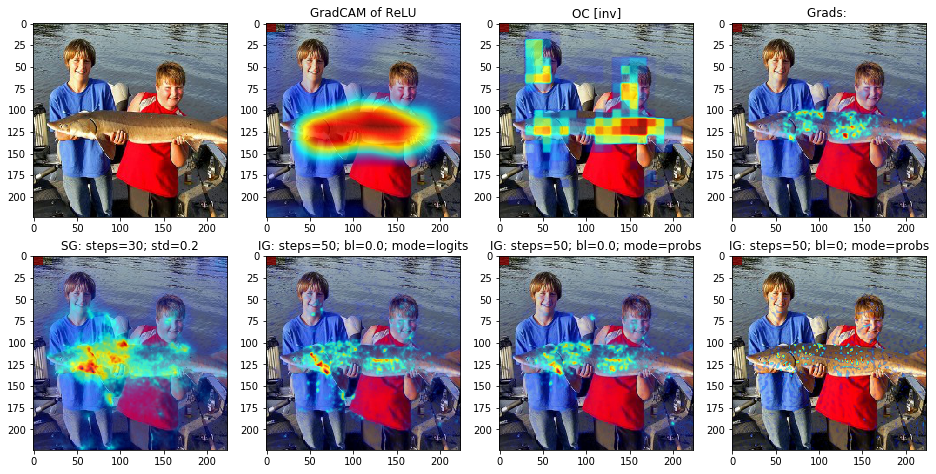
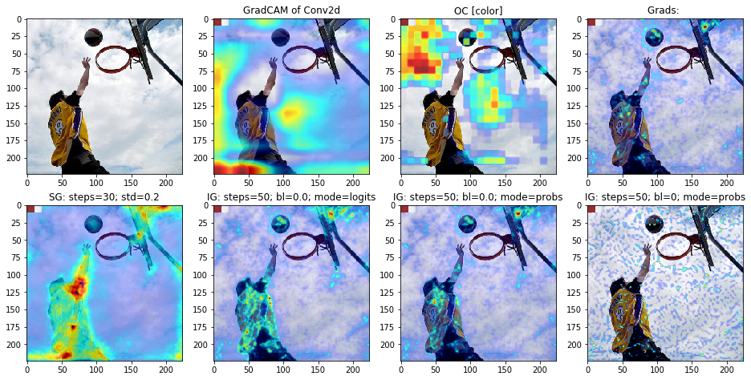
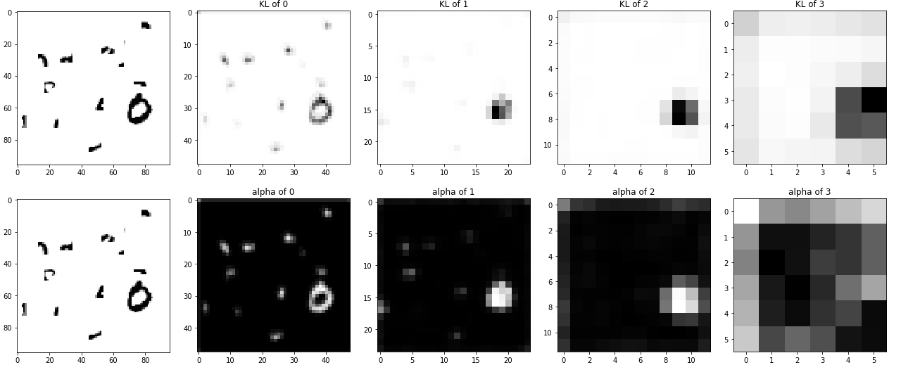

# Attribution Experiments

Implementation and tests of several attribution methods:
* Saliency maps: https://arxiv.org/abs/1312.6034
* Integrated Gradients: https://arxiv.org/abs/1703.01365
* SmoothGrad: https://arxiv.org/abs/1706.03825
* Grad-CAM: https://arxiv.org/abs/1610.02391
* Occlusion: https://arxiv.org/abs/1311.2901
* Information Dropout: https://arxiv.org/abs/1611.01353 (repurpose as attribution method)

... and maybe some others soon.

## Example
```python
import matplotlib.pyplot as plt
from attribution.methods.grad_based import SmoothGrad
from attribution.utils.viz import Heatmap

# the model to be inspected
model = ...  # type: torch.nn.Module

# the image to analyse
img = ...  # type: torch.Tensor

# the target label to derive from, ground truth or any other
target = ...  # type: torch.Tensor

# get heatmap for this input image
method = SmoothGrad(model, std=0.2)
hmap = method.get_map(img=img, target=target)

# visualize the result
fig = plt.figure() # the figure to paint to, may be subfigure
visualizer = Heatmap()
visualizer.show(hmap=hmap, img=img, fig=fig)
```

## Good Example
"sturgeon"


## Bad Example
"basketball"


## Information Dropout
On cluttered MNIST

