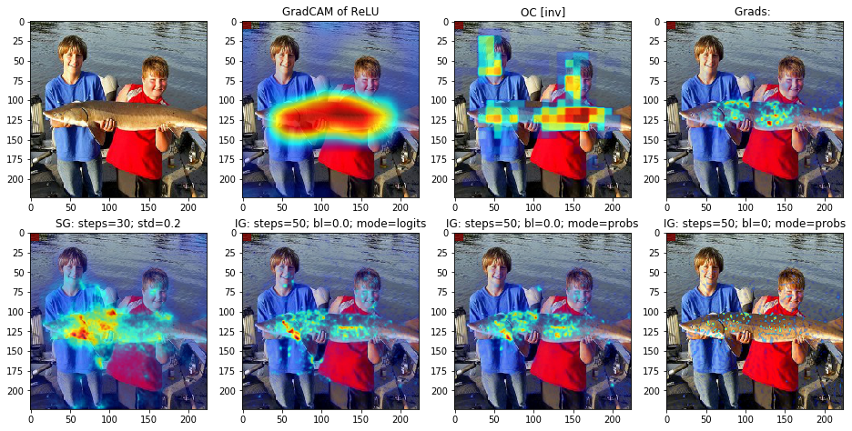

# Attribution Experiments

Implementation and tests of several attribution methods:
* Saliency maps: https://arxiv.org/abs/1312.6034
* Integrated Gradients: https://arxiv.org/abs/1703.01365
* SmoothGrad: https://arxiv.org/abs/1706.03825
* Grad-CAM: https://arxiv.org/abs/1610.02391
* Occlusion: https://arxiv.org/abs/1311.2901

... and trying new approaches e.g. by restraining information flow (informational dropout).

Files:
* /methods: attribution methods, grouped by families
* /deployment: data loader, visualizer etc.
* notebooks: test scripts

## Good Example
"sturgeon"

## Bad Example
"basketball"

